# Environment Setting
## Important Links
* [Gitlab](https://ssl-gitlab.csie.ntut.edu.tw): https://ssl-gitlab.csie.ntut.edu.tw

* [Jenkins](https://ssl-jenkins.csie.ntut.edu.tw): https://ssl-jenkins.csie.ntut.edu.tw

* [Facebook](https://www.facebook.com/groups/2375902846050428/about/): https://www.facebook.com/groups/2375902846050428/about/


## IDE Recommend
* [Atom](https://atom.io/)
* [Visual Studio Code](https://code.visualstudio.com/)

## Category
1. Computer Environment Setting
2. [Homework Upload Tutorial](#homework-upload-tutorial)

## Computer Environment Setting
* [Windows 10](#windows-10)
* [MacOS](#macos)

## Windows 10  
### 1. Open developer mode on window  
  
  

### 2. Enable Linux version Windows sub system.  
  
  

### 3. Install Ubuntu on Microsoft Store and activate it.


### 4. Now you can open bash shell in cmd.  


### 5. Run the following command under bash shell.  
Reference: [https://www.eriksmistad.no/getting-started-with-google-test-on-ubuntu/](https://www.eriksmistad.no/getting-started-with-google-test-on-ubuntu/)  
```
sudo apt-get update
sudo apt-get install g++
sudo apt-get install make
sudo apt-get install libgtest-dev
sudo apt-get install cmake
cd /usr/src/gtest 
sudo cmake CMakeLists.txt 
sudo make 
cd lib
sudo cp *.a /usr/lib
```

## MacOS  

### 1. Download [GoogleTest](https://github.com/google/googletest/releases/tag/release-1.8.0) and run the following command.   
Reference: [https://gist.github.com/massenz/41bb2c8375294f4d9927](https://gist.github.com/massenz/41bb2c8375294f4d9927) 
```
brew install cmake
cd ~/Downloads/googletest-release-1.8.0/googletest
mkdir build
cd build
cmake –Dgtest_build_samples=ON –Dgtest_build_tests=ON ~/Downloads/googletest-release-1.8.0/googletest
make
sudo mkdir /usr/local/Cellar/gtest
sudo cp ~/Downloads/googletest-release-1.8.0/googletest/build/libgtest.a /usr/local/Cellar/gtest/
sudo ln –snf /usr/local/Cellar/gtest/libgtest.a /usr/local/lib/libgtest.a
sudo cp –r ~/Downloads/googletest-release-1.8.0/googletest/include /usr/local/Cellar/gtest/
ln –snf /usr/local/Cellar/gtest/include/gtest /usr/local/include/gtest
```


## Homework Upload Tutorial

### First Setting(Only first time needs to do setting)
1. Make the project directory on your pc.<br/><br/>
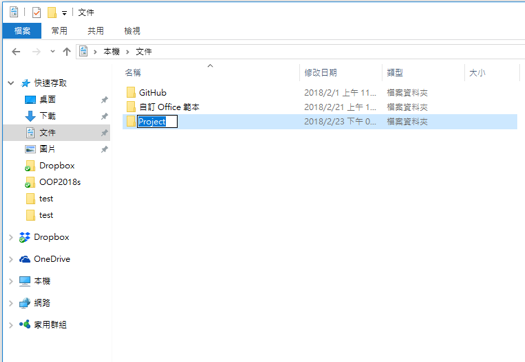

2. Open the terminal and enter the following command.<br/><br/>
Get in to project directory and initialize as git project.
```
$ cd /path/to/your/project
$ git init
```
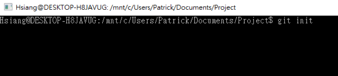

3. Go to [Gitlab](https://ssl-gitlab.csie.ntut.edu.tw) to find your own project link.<br/>
**Suggestion**: Use https link instead of ssh link.<br/><br/>
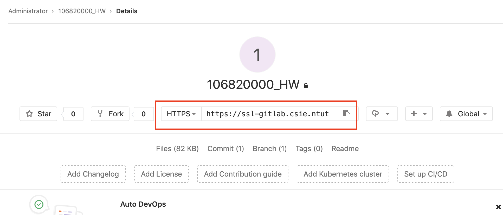

4. Link your git project to Gitlab repository.<br/><br/>
Enter following command:
```
$ git remote add origin ${YOUR_URL}
```
** Replace ${YOUR_URL} with the gitlab project link from step 3.<br/><br/>
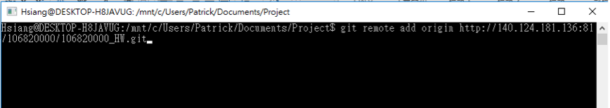

### Upload Homework
1. Look up the current status of git repository.<br/><br/>
Enter following command:
```
$ git status
```
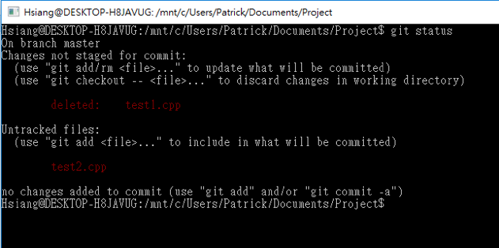

2. Add the new/modified files to "Changes to be committed" queue:<br/><br/>
Enter following command:
```
$ git add .
```
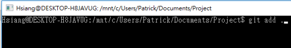<br/><br/>
If the file status is "deleted", you'll need rm command:
```
$ git rm ${FILE_NAME}
```
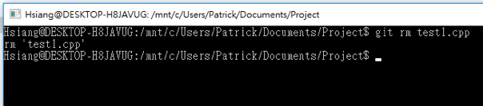

3. Check the current status again.
```
$ git status
```
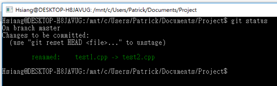

4. If the status in step 3 is correct, you can commit the current changes to git history.<br/><br/>
By following command:
```
$ git commit -m "${YOUR_COMMIT_MESSAGE}"
```
${YOUR_COMMIT_MESSAGE} is the message to describe the current changes you commit.<br/><br/>
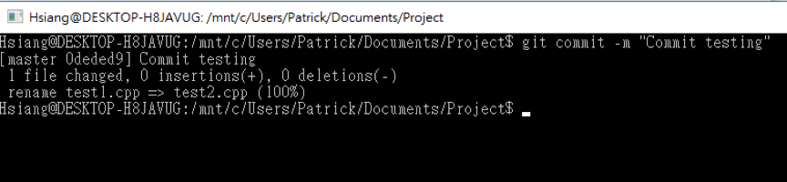<br/><br/>
4.5 If it's your first time to commit in your device, system will require you to provide your personal info.<br/><br/>
Enter the following commands to fill in infos.
```
$ git config --global user.email ${YOUR_EMAIL}
$ git config --global user.name ${YOUR_NAME}
```
Then you can enter the commit message in step 4 again.

5. Push your local commits to Gitlab server.<br/><br/>
Enter the following command:
```
$ git push -u origin master
```
And enter your username & password.<br/><br/>
** The password won't show when you enter.<br/><br/>
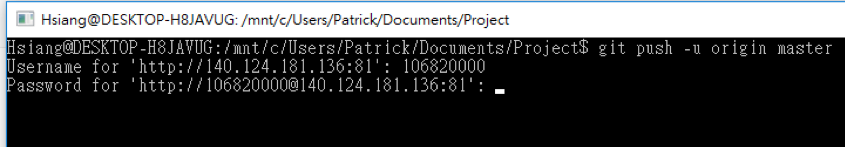

### Check homework status
1. Go to [Gitlab](https://ssl-gitlab.csie.ntut.edu.tw) to check your upload status.<br/><br/>
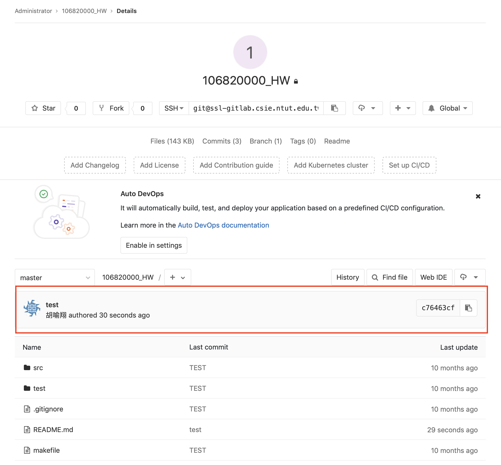

2. Go to [Jenkins](https://ssl-jenkins.csie.ntut.edu.tw) to check your homework status.<br/><br/>
The username and password are default in your **student ID**<br/>
For example, username: 106820000, password: 106820000<br/>
Please login and modified to your own password

* Projects to check:
  * Check ${COURSE}_${STUDENT_ID}_HW, for example: psod2020f_106820000_HW.<br/>- This project is for executing student's own unit tests.
  * Check ${COURSE}_${STUDENT_ID}_HW_TA, for example: psod2020f_106820000_HW_TA.<br/>- This project is for executing TA provided unit tests.
* Project status:
  * Blue: all unit tests passed.
  * Red: some tests failed, or compile failed.<br/><br/>
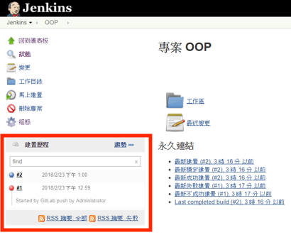

If you click blue/red light, you can see the execution console to check execution status.<br/><br/>
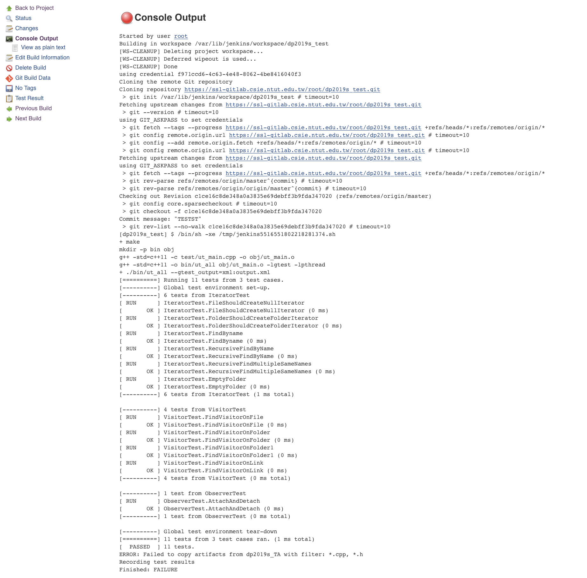
